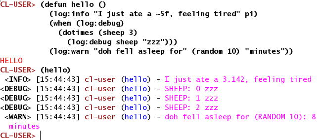
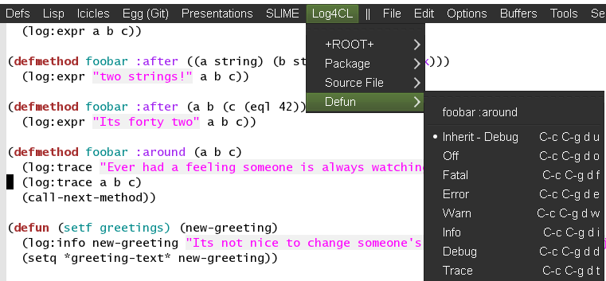
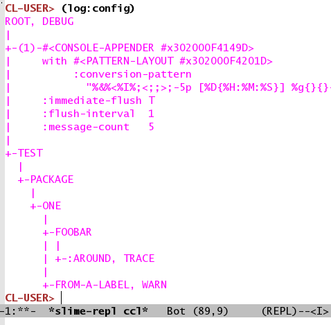
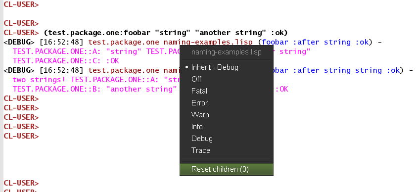

# <a id="sec-1" name="sec-1"></a>Introduction

This document describes new development version of Log4CL, which is
not yet available in QuickLisp. It will become available in QuickLisp
after a few months shakeout. The Log4CL Emacs/Slime integration module
is called **Log4Slime**.

This guide is written with assumption you'll have Log4Slime loaded and
enabled, because Log4Slime is the most likely reason you'll be using
development version anyway.

## <a id="sec-1-1" name="sec-1-1"></a>Installation

You will need to use QuickLisp's `~/quicklisp/local-projects` feature

```sh
cd ~/quicklisp/local-projects
git clone git://github.com/7max/log4cl.git 
```

Then use the `(ql:quickload :log4cl)` from REPL to load it. 

Best effort had been made so that new development version can be
loaded directly on top of the stable one, in the same Lisp image, but
due to many changes to Log4CL internals, while it seems to be working,
its recommended that you nuke FASL's from
`~/.cache/common-lisp/**/log4cl/` directory (or use Slime's
,delete-system-fasl command) and restart the Lisp.

## <a id="sec-1-2" name="sec-1-2"></a>Enabling Log4Slime

```cl
(ql:quickload :log4slime)
(log4slime:install)
```

You should get a message like this:

```
Wrote ~/quicklisp/log4slime-setup.el

Add the following two statements to your ~/.emacs file
------------------------------------------------------
(load "~/quicklisp/log4slime-setup.el")
(global-log4slime-mode 1)
------------------------------------------------------
```

Follow the above instructions. The most likely point of failure here
may be `log4slime.el` trying to poke the Lisp side to see if log4slime
is loaded, and that for some reason it fails.

If it fails, there should be a message in `*Messages*` buffer, that looks
like this: `Unable to load log4slime lisp support: <lisp side condition>`

In case you did get the above message and you think you fixed the
cause, you can make log4slime try again, by turning `M-x
global-log4slime-mode` off/on a few times

You can verify if log4slime is enabled, by looking for the Log4CL menu
on top menubar in REPL and Lisp mode buffers, or by submitting a log
statement from REPL and seeing output colorized.

<a id="The-Basics" name="The-Basics"></a>

# <a id="sec-2" name="sec-2"></a>Hello world

```cl
(progn
  (log:info "I just ate a ~5f, feeling tired" pi) 
  (when (log:debug)
    (dotimes (sheep 3)
      (log:debug sheep "zzz")))
  (log:warn "doh fell asleep for" (random 10) "minutes"))
```

Should produce the following output


You can notice several things right away.

-   You can intermix strings and expressions, and expressions will be
    printed as their un-evaluated form as well as the their value;
    using a constant `FORMAT` control string as first argument
    automatically switches to `FORMAT` mode.

-   Log statements without arguments, turn into conditional expression
    that tells you if logging is enabled or not

-   The log output contains some headers in addition to the raw log
    message, such as the [log level](#level) that message was submitted with,
    the time of the message as well as what looks like the name of the
    current package, and (If you have Log4Slime loaded and turned on),
    these headers use different faces from actual log message.

## <a id="sec-2-1" name="sec-2-1"></a>Changing the log level

You can change the [log level](#level) with by doing
`(log:config :debug)` from `REPL`. Alternatively, with
Log4Slime enabled in `REPL` buffer, you can right-click on the
**cl-user** part and change the log level from a popup menu.


There is a slight difference between doing it using above two
methods, with `log:config` command, the level is changed for the
`ROOT` [category](#category), but right clicking on the package
name, changes the [log level](#level) only for that package.

To change the `ROOT` [category](#category) from Emacs, you can use Log4CL
dropdown submenu, or Emacs command `log4slime-level-selection` which
is bound to `C-c C-g` by default.

After pressing `C-c C-g` which invokes the `log4slime-level-selection` command
you get the following window.


Pressing "P" to select the "Package" shows the selected [category](#category)
current [effective](#effective) log level and offers choice to set a different
one. In above screenshot `CL-USER` [category](#category) does not have its own log level,
instead in inherits one from the ROOT [category](#category)


This concludes the very basic introduction, if you were confused by
what various terms such as "[category](#category)" mean, click on the
hyperlink to read more about Log4CL concepts.

Or you can skip the theory and just continue to learn by example.

<a id="naming" name="naming"></a>

# <a id="sec-3" name="sec-3"></a>Automatic category naming

Try putting the from the previous section into a `DEFUN` instead of a
`PROGN` form like so:

```cl
(defun hello ()
  (log:info "I just ate a ~5f, feeling tired" pi) 
  (when (log:debug)
    (dotimes (sheep 3)
      (log:debug sheep "zzz")))
  (log:warn "doh fell asleep for" (random 10) "minutes"))
```

If you run it now, the output under both **SBCL** and **CCL** should
look like this.



Right click on the blue function name, allows you to change the log
level for that specific function.

That is because Log4CL logging macros, automatically determine the
[category](#category) for logging, based on the context where log statement
appears. In above example the function was defined in the package
CL-USER and function name was HELLO, so the target category of any
logging inside the function, was automatically `CL-USER.HELLO`

It starts with the package, then function. You can try
putting one of the log statements inside of a `LABELS` or `FLET`
forms, to see what happens.

Also note the farthest to the right in the logging [category](#category)
name, the more specific. The level for "hello" overrides that for
"cl-user", which in turn overrides that of the root category.

## <a id="sec-3-1" name="sec-3-1"></a>Enter the source files

For the next few examples, it is recommended that you load the
examples come together with Log4CL, by doing `(ql:quickload :log4cl-examples)`

It should produce the following output:


One thing you should notice, is that source file where function is
defined now appears as part of the log message too. Go to the source
of "greetings". Before you try to use Slime's famous `M-.` shortcut, try
clicking on blue "greetings" word with a left mouse button.

If everything went better then expected, it should land you at the first
log statement of the `(defun greetings ())`. Cool eh?

## <a id="sec-3-2" name="sec-3-2"></a>Naming in CLOS methods

Quickly browse through `naming-examples.lisp`. There are a few methods defined,
including `:after/:around` methods, as well as some with `EQL` specializers. 

Run a few of them from REPL, like so:


Log statements inside of methods, are using the [category](#category) name of the 
generic function, extended with qualifier, and all non-T specializers.

Note how by changing the level of the "foobar" you control all the
methods, but can override them based on their specializers. Try
setting :after category to different levels, to control all
the :after methods together.

In addition to playing with methods, try `(setf (test.package.one:greetings) "Hey")` too.

## <a id="sec-3-3" name="sec-3-3"></a>Context sensitivity

As you browse through source, and are inside of one of the methods, 
check out the Log4CL dropdown menu. Note that "Defun" submenu changes
for each method.



## <a id="sec-3-4" name="sec-3-4"></a>Keyboard level selection

Also try `C-c C-g` shortcut in the same place. You can configure it
not to show the selection window at all, by customizing the
`log4slime-level-selection-single-key` Emacs variable.

After pressing `C-c C-g` while inside of the method


You can change keys for the selecting various levels by doing `M-x
   customize-group RET log4slime RET`

Note that keyboard selection ignores the Control key so `C-c C-g p
   u` is same as `C-c C-g C-p C-u`

## <a id="sec-3-5" name="sec-3-5"></a>Resetting the mess

If you had forgotten which levels you set for what, and just want
to see which levels are set where.

You can display current logging configuration by doing
`(log:config`) without any arguments, it willdisplay a tree



If you have had set a lot of custom levels, and now need to get rid
of them, "Reset Children" menu item will nukes the log level from
everything underneath the parent. Doing "Reset Children" on the
ROOT category, gets rid of every other log level that was set
anywhere. Keyboard equivalent is `C-c C-g r`



## <a id="sec-3-6" name="sec-3-6"></a>Logging configurations

After setting the log levels of a few methods, try doing `(log:save :foo)` 
then messing around.. You can restore the named configuration with 
`(log:restore :foo)`. Configurations are saved in a file in the
home directory, so they survive image restarts

See the [Finding needle in a haystack](#needle) section.

# <a id="sec-4" name="sec-4"></a>The magic of (LOG:CONFIG)

Section To be written, for now simply see [docstring for LOG:CONFIG](http://github.com/7max/log4cl/blob/master/src/configurator.lisp)

Read the docstring and play with options, below are a few examples:


# <a id="sec-5" name="sec-5"></a>Pattern Layout

Section to be written, for now see docstring for
[docstring for PATTERN-LAYOUT](http://github.com/7max/log4cl/blob/master/src/pattern-layout.lisp)

# <a id="sec-6" name="sec-6"></a>Common Practices

Some common recipes.

## <a id="sec-6-1" name="sec-6-1"></a>Log levels for production

Generally log levels `INFO` and below, are used in normal
operations of software, while levels higher then `INFO` are used
by programmers.

-   `FATAL` is used for un-recoverable errors, that
    require restart of an application or major component, the `FATAL`
    messages are to inform the user that something had died in a 
    way that should not normally happen.

-   `ERROR` is for serious but generally recoverable errors, that occur
    doing a normal operation of software. File not found, or such.

-   `WARN` is for "suspicious" things, or to inform the user that
    some automatic corrective action had failed. Maximum number of retries reached
    or such.

-   `INFO` is for informing on major steps that software is performing, and
    is usually thought of the maximum log level used in normal operations, its
    "Say what you are doing but don't flood" type of messages.

By default Log4CL is configured with root category having `INFO`
log level.

<a id="development" name="development"></a>

## <a id="sec-6-2" name="sec-6-2"></a>Log levels for development

`DEBUG` is for for informing about detailed steps taken by operations
and printing intermediate values. 

`TRACE` is for very detailed debugging, like printing variables inside
loops and such.

`DEBU1..DEBU9` log levels are numerically around the `TRACE` and can be used
if you need more granularity. One possibility is that `(log:expr)` macro, can
be configured via `LOG:PACKAGE-OPTIONS` mechanism, to use different
log level then `DEBUG` and can set to use one of the extra levels.


`OFF` log level is very important counter-part for `DEBUG` and
`TRACE`.  Its used for "narrowing things down in reverse", which is
described in the next section

<a id="needle" name="needle"></a>

## <a id="sec-6-3" name="sec-6-3"></a>Finding needle in a haystack

Programmers often need to concentrate on a specific area of their
software.  With traditional non-hierarchical logging system,
having a lot of debug sprinkled around the code, flood the
programmers with a lot of information they don't need, and makes
it hard to find the messages relevant to the problem being
debugged.

Because Log4CL is hierarchical, its easy to narrow down the
logging, to focus on exactly the right area, by using the
following process.

1.  Turn `DEBUG` on for the root category, or entire package and
    then run your code through the functionality that you are
    focusing on. REPL will fill with a lot of debugging output.

2.  Right-click on each message that is not related to a problem,
    and turn the corresponding category `OFF`. You can how go wide
    or narrow, turn off entire packages or source files, or by
    individual methods, functions or local functions. If you went
    too far, use **Reset children** command on the parent category.
    
    If you use CLOS, use the category hierarchy to your advantage,
    if for example you think problem relates to before or after
    method, you can can control logging for all :AFTER methods of
    generic function by clicking :after category in 
    `(<gf name> :after <specializer> ...)`

3.  Once you narrowed down the logging to your liking, you can
    quickly save that configuration of log levels with
    `(LOG:SAVE)`, and later (may be in a different image, or even
    different machine) restore it with `(LOG:RESTORE)`, and you can
    give these saved configuration names, such as
    `(LOG:SAVE :bug-123)`

# <a id="sec-7" name="sec-7"></a>Glossary

Very small glossary of Log4CL concepts

<a id="logger" name="logger"></a><a id="category" name="category"></a>

## <a id="sec-7-1" name="sec-7-1"></a>Loggers and categories

Loggers are named singleton objects that form a hierarchy, and are
sources of log messages, or more correctly entry points where log
message enter the logging system.  Each call to a logging macro like
`(log:debug ...)` operates on a specific logger object 
(See also [naming](#naming) section).

Logger's unique name is called "logger's category", or "category
name". Loggers form a hierarchy, based on their category names,
where child loggers have their category name prefixed by that of the
parent, followed by a dot. So if we have loggers **A**, **A.B**, **A.B.C**
and **A.B.D** then logger **A** is parent of **A.B**, which has two
children **A.B.C** and **A.B.D** - as shown on below diagram.  (Note:
ROOT logger category name is empty string)

```
ROOT---A---A.B---A.B.C
             |
             \---A.B.D
```

Because loggers are singletons, logger category name is usually shortened to just
*CATEGORY* and is used inter-changeably with the word *LOGGER*; the convention
is that thing is "a logger" when talking about actual Lisp object, and
"category" otherwise.

Each logger can have a [log level](#level) threshold, or if its
does not have one, it inherits one from its parent. To ensure that
for any logger, an effective log level can be determined, the ROOT
logger always have a level.

Loggers will only pass through messages, if logger's threshold level
is equal or greater verbosity, then log message. For example if in
above example logger A is configured with *info* log level, then
`(log:warn ...)` and `(log:info)` messages will be passed through,
but `(log:debug)` messages would not.

<a id="appender" name="appender"></a>

## <a id="sec-7-2" name="sec-7-2"></a>Appenders

Appenders process log messages by writing them to files, or
displaying them on the screen. Appenders attach to a specific
logger, and each logger can have many appenders attached.

When a log message passes through a logger that has appenders, they
are all called in turn to do appender specific processing, be it
writing log message to a file, or a terminal. After all of logger's
appenders had processed the message, its passed on to the parent
logger.

So log messages inheritance flows in reverse order from the log
level one, tricking up from child loggers towards root, with below
exception.

Each logger has a property called *additivity*, which is `T` by
default, which controls the above process. When additivity is
`NIL`, logger is called non-additive and any messages that reach
it, will not be passed to the parents.

Usually only root logger, or non non-additive loggers will have any
appenders attached to them.

<a id="layout" name="layout"></a>

## <a id="sec-7-3" name="sec-7-3"></a>Layouts

When appender decide they want to process the log message, they format
the log message by means of a layout. Layout is a separate object, that attaches
to each appender, and is responsible for the textual formatting of the message.

So while appender provides and manages any serialization for the
stream to write to, the layout is actually formatting the log
message into that stream.

Log4CL provides two layouts, SIMPLE-LAYOUT which is well, simple,
and a very configurable PATTERN-LAYOUT, which specifies the formatting
of log messages by mean of printf/format like control string.

Easiest way to use the pattern layout, is by using [LOG:CONFIG](http://github.com/7max/log4cl/blob/master/src/configurator.lisp)
command to select between several predefined formats.

Or you can look for list of all supported format documentation for
the [PATTERN-LAYOUT](http://github.com/7max/log4cl/blob/master/src/pattern-layout.lisp) class. Please note that if you are
drafting your own format, that Log4SLime fontification relies on
regular expressions and the log messages being in a certain
order. If your layout is not a minor modification of an built-in
one, the Log4Slime fontification may stop working.  You can of
course adjust the regular expressions used by Log4Slime to match
your own custom layout to compensate.

<a id="level" name="level"></a><a id="log-level" name="log-level"></a>

## <a id="sec-7-4" name="sec-7-4"></a>Log Levels

In Log4CL log levels are numeric constants, in order of increased
verbosity: 

-   Turn off logging `0=OFF`

-   Standard log levels `1=FATAL`, `2=ERROR`, `3=WARN`, `4=INFO`, `5=DEBUG`

-   Extra debug levels `6..9` named `DEBU1` through `DEBU4`

-   Standard log level `10=TRACE`

-   Extra debug level `11..15` named `DEBU5` through `DEBU9`

<a id="effective" name="effective"></a>

## <a id="sec-7-5" name="sec-7-5"></a>Effective log level

Effective log level of the logger **X** is determined as follows.

1.  If logger has level threshold set, then this level is the effective log level.

2.  If logger is not first child of a parent, whose category is same as the package 
    name logger was instantiated from, the effective log level of **X** is the effective
    log level of its parent logger.

3.  If logger is first child of a parent **P** named same as package,
    and there exists a sibling logger **S**, with the last part of
    category name equal to that of a source file logger **X** was
    instantiated from, and **S** has a level threshold set, that level
    is effective level of logger **X**

4.  Otherwise effective level of logger **X** is effective level of its parent.

ROOT logger always has a level threshold set, so above steps always
result in a valid log level.

Effective log level is returned by the function `(log4cl:effective-log-level LOGGER)` 

# <a id="sec-8" name="sec-8"></a>FAQ

## <a id="sec-8-1" name="sec-8-1"></a>I don't see log messages from other threads.

The `*TERMINAL-IO*` value bound in the other threads is probably different and points  
to other place (likely `*inferior-lisp*` buffer under Slime)

1.  `(log:config :sane2)` will copy messages from other threads to `REPL`
    while continuing output to thread specific `*TERMINAL-IO*` (`REPL`
    thread will still only log to `REPL`)

2.  `(log:config :sane :this-console)` will redirect all logging to current console
    regardless of thread local values of `*TERMINAL-IO*`

## <a id="sec-8-2" name="sec-8-2"></a>Why Log4CL starts its own thread, and how I get rid of it

Its a flusher thread to flush the appenders, it increases
performance greatly when there is a lot of logging.oe

You can stop it by calling `(log4cl:stop-hierarchy-watcher-thread)`

On SBCL Log4CL uses `*EXIT-HOOKS*` and `*SAVE-HOOKS*` to
automatically flush all appenders on exit, so that last second of
logging is not lost, and to terminate the watcher thread when
saving image, which can't be done with multiple threads running.

## <a id="sec-8-3" name="sec-8-3"></a>I'd like just the log messages, and not all the extra stuff

Use pattern layout with just %m%n format (message + newline)

## <a id="sec-8-4" name="sec-8-4"></a>How do I log into a file

`(log:config :daily "file.txt")` which will be backed up each day to
`file.txt.YYYYMMDD`

### <a id="sec-8-4-1" name="sec-8-4-1"></a>I want both log file and backup log file to have YYYYMMDD prefix or roll once per week

`(log:config :daily "file.txt.%Y%m%d")` file will roll when %Y%m%d expansion
changes.

### <a id="sec-8-4-2" name="sec-8-4-2"></a>What about just one plain file, without rolling

`(log:config :daily "file.txt" :backup nil)`
